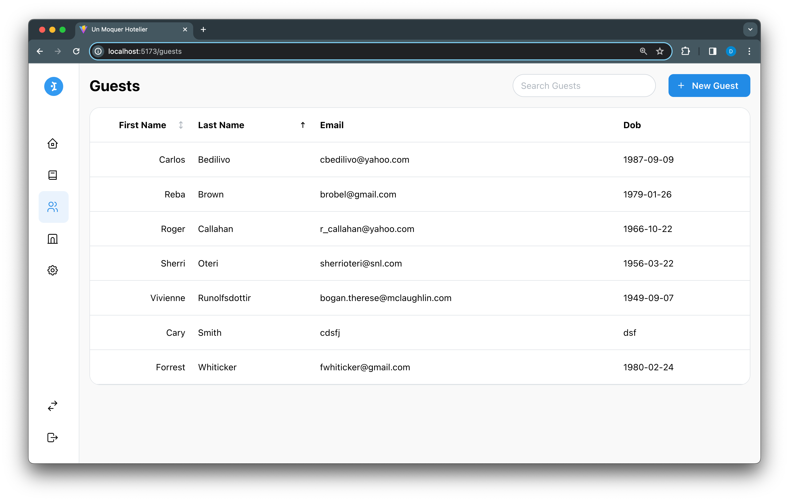

# Un Moquer Hotelier + TypeScript + Mantine

## Tooling List

- [Yarn](https://yarnpkg.com/) - Package Manager
- [Vite](https://vitejs.dev/) - Front End Build Tool
- [TypeScript](https://www.typescriptlang.org/) - Strict Typing for JavaScript
- [React](https://react.dev/) - Front End Composition
- [React Router](https://github.com/remix-run/react-router#readme) - SPA Router
- [React Query](https://tanstack.com/query/v4/docs/react/overview) - Data Fetching
- [Mantine UI Library](https://mantine.dev/) - UI Components and Helpers
- [Mantine Data Table](https://icflorescu.github.io/mantine-datatable/) - More Robust Data Table
- [Lodash](https://lodash.com/) - Helper Functions
